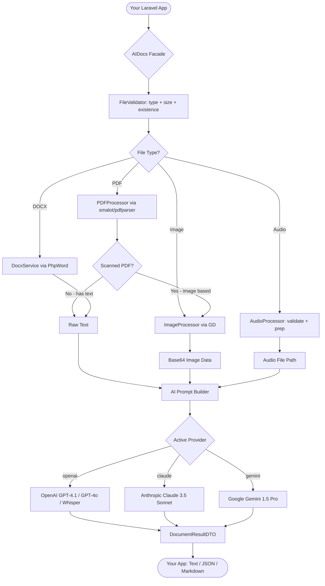
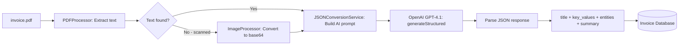
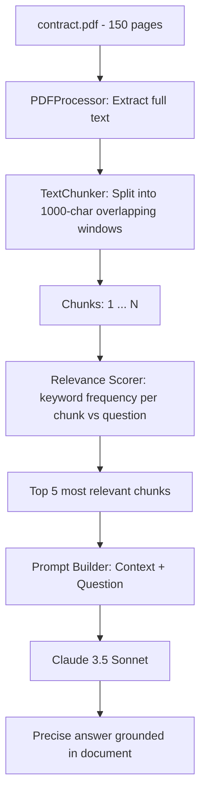
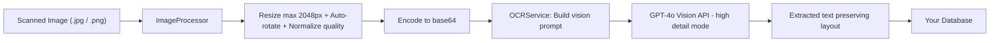
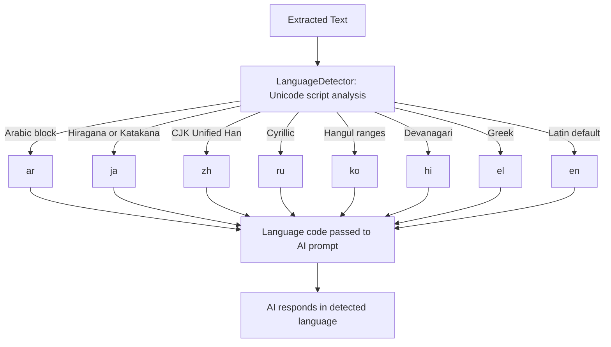
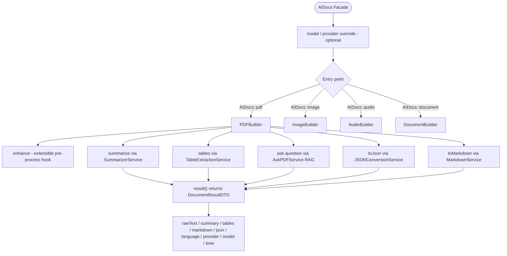

# Laravel AI Docs

[](https://packagist.org/packages/subhashladumor1/laravel-ai-docs)
[](https://www.php.net)
[](https://laravel.com)
[](LICENSE)
[](#testing)

> **Turn any PDF, image, audio or Word document into structured, searchable intelligence — powered by GPT-4, Claude 3.5, or Gemini 1.5 — with a single line of Laravel code.**

---

## What Is This Package?

Imagine your users are uploading invoices, contracts, scanned receipts, meeting recordings or medical reports. You need to extract data, answer questions, generate summaries, and build searchable databases — without writing thousands of lines of AI integration code.

**Laravel AI Docs** handles all of that with a fluent, chainable API:

```php
// Extract, summarize and convert an invoice to JSON in one chain
$data = AIDocs::pdf($invoice)->toJson();

// Ask a natural-language question about a contract
$answer = AIDocs::pdf($contract)->ask('What is the payment due date?');

// Transcribe a meeting audio and summarize it
$summary = AIDocs::audio($recording)->summarize();

// OCR a handwritten receipt into structured text
$text = AIDocs::image($receipt)->text();
```

---

## How It Works

The package sits as an intelligent layer between your Laravel app and AI providers. When you call `AIDocs::pdf($file)`, it:

1. **Validates** the file (type, size, existence)
2. **Extracts** raw content using native parsers (smalot/pdfparser, PhpWord)
3. **Detects** if the document is scanned and needs OCR
4. **Processes** images or audio through pre-processing pipelines
5. **Sends** a carefully crafted prompt to your chosen AI (OpenAI, Claude, or Gemini)
6. **Returns** the result as a string, array, or typed `DocumentResultDTO`



---

## Installation

```bash
composer require subhashladumor1/laravel-ai-docs
```

Publish the config file:

```bash
php artisan vendor:publish --tag=ai-docs-config
```

Add your API keys to `.env`:

```env
# Pick at least one provider
OPENAI_API_KEY=sk-...
ANTHROPIC_API_KEY=sk-ant-...
GEMINI_API_KEY=AIza...

# Which provider to use by default
AI_DOCS_PROVIDER=openai
```

---

## Real-World Example 1 — Invoice Processing System

Your e-commerce platform receives thousands of supplier invoices as PDFs every day. You need to extract line items, totals, vendor names and due dates automatically.

```php
use Subhashladumor1\LaravelAiDocs\Facades\AIDocs;

class InvoiceProcessor
{
    public function process(string $pdfPath): array
    {
        // Extract ALL structured data from the invoice in one call
        $data = AIDocs::model('gpt-4.1')->pdf($pdfPath)->toJson();

        // $data contains:
        // [
        //   'title'         => 'Invoice #INV-2024-00892',
        //   'document_type' => 'invoice',
        //   'date'          => '2024-03-15',
        //   'author'        => 'ACME Supplies Ltd.',
        //   'key_values'    => [
        //       'invoice_number' => 'INV-2024-00892',
        //       'subtotal'       => '$4,200.00',
        //       'tax'            => '$420.00',
        //       'total'          => '$4,620.00',
        //       'due_date'       => '2024-04-15',
        //   ],
        //   'key_entities'  => ['ACME Supplies Ltd.', 'John Doe', 'USD'],
        //   'summary'       => 'Invoice for 12 units of server hardware...',
        // ]

        Invoice::create([
            'vendor'     => $data['author'] ?? 'Unknown',
            'total'      => $data['key_values']['total'] ?? '0',
            'due_date'   => $data['key_values']['due_date'] ?? null,
            'raw_data'   => $data,
        ]);

        return $data;
    }
}
```

**How the data flows for this example:**



---

## Real-World Example 2 — Legal Contract Q&A Chatbot

A law firm wants to let paralegals ask plain-English questions about uploaded contracts without reading hundreds of pages.

```php
class ContractChatbot
{
    public function chat(string $contractPath, string $question): string
    {
        // The package automatically chunks the contract into overlapping
        // windows, scores each chunk for relevance, then sends only the
        // relevant context to the AI (RAG pipeline).
        return AIDocs::model('claude-3-5-sonnet')
            ->pdf($contractPath)
            ->ask($question);
    }
}

// Usage in a controller:
$bot = new ContractChatbot();

$bot->chat($contract, 'What is the termination notice period?');
// → "Either party may terminate with 30 days written notice per Section 12.3."

$bot->chat($contract, 'What are the payment terms?');
// → "Payment is due net-30 from invoice date. Late payments accrue 1.5% monthly interest."

$bot->chat($contract, 'Is there an exclusivity clause?');
// → "Yes, Section 8 grants Client exclusivity in the APAC region for 24 months."
```

**How the RAG pipeline works:**



---

## Real-World Example 3 — Medical Report Digitization

A hospital scans paper patient forms. The images need to be converted to searchable database records.

```php
class MedicalFormDigitizer
{
    public function digitize(string $imagePath): array
    {
        // Works with scanned photos, JPG, PNG — any image format
        $text = AIDocs::image($imagePath)
            ->language('en')
            ->text('Extract all medical data: patient name, DOB, diagnosis codes, medications, allergies, and physician name.');

        // Parse fields from the extracted text
        return $this->parseFields($text);
    }

    public function digitizeArabicReport(string $imagePath): string
    {
        // Full Arabic OCR — auto-detected language
        return AIDocs::image($imagePath)->text();
        // Language detected automatically as 'ar'
    }
}
```

**Image OCR flow:**



---

## Real-World Example 4 — Meeting Minutes Automation

Your team records all meetings. You want automatic transcriptions and action-item summaries sent to Slack.

```php
class MeetingAutomator
{
    public function process(string $audioPath): void
    {
        $builder = AIDocs::audio($audioPath)->language('en');

        // Step 1: Get full transcription
        $transcript = $builder->transcribe();

        // Step 2: Summarize with action items
        $summary = $builder->summarize(
            'List all action items, decisions made, and owners. Use bullet points.'
        );

        // Step 3: Store and notify
        Meeting::create([
            'transcript' => $transcript,
            'summary'    => $summary,
            'duration'   => now(),
        ]);

        Notification::send(
            User::managers()->get(),
            new MeetingSummaryNotification($summary)
        );
    }
}
```

---

## Real-World Example 5 — Multi-Language Document Portal

A global company receives documents in English, Arabic, French, Chinese, and Russian. Your portal needs summaries in the original language.

```php
class DocumentPortal
{
    public function summarize(string $filePath): string
    {
        // Language is auto-detected from content (Unicode script analysis)
        // Summary is returned in the detected language automatically
        return AIDocs::pdf($filePath)->summarize()->text();

        // Arabic PDF  → Arabic summary
        // Chinese PDF → Chinese summary
        // French PDF  → French summary
    }

    public function summarizeInEnglish(string $filePath): string
    {
        // Force English output regardless of source language
        return AIDocs::pdf($filePath)
            ->language('en')
            ->summarize()
            ->text();
    }

    public function bulkProcess(array $files): array
    {
        return array_map(fn($file) => [
            'file'    => basename($file),
            'summary' => AIDocs::pdf($file)->summarize()->text(),
            'tables'  => AIDocs::pdf($file)->tables()->result()->tables,
            'json'    => AIDocs::pdf($file)->toJson(),
        ], $files);
    }
}
```

**Language detection flow:**



---

## Real-World Example 6 — Financial Report Dashboard

A fintech app ingests quarterly earnings PDFs and extracts all financial tables for charting.

```php
class FinancialReportParser
{
    public function parse(string $reportPath): array
    {
        // Full pipeline: extract text → find tables → summarize → markdown
        $result = AIDocs::model('gpt-4.1')
            ->pdf($reportPath)
            ->enhance()       // pre-process PDF
            ->tables()        // extract all data tables
            ->summarize()     // executive summary
            ->result();       // get DocumentResultDTO

        // Access structured data
        foreach ($result->tables as $table) {
            echo $table->title . "\n";      // "Revenue by Quarter"
            echo $table->toMarkdown() . "\n"; // markdown table

            // Headers + rows as arrays for charting
            $chartData = [
                'labels' => $table->headers,
                'rows'   => $table->rows,
            ];
        }

        return [
            'summary'    => $result->summary,
            'tables'     => count($result->tables),
            'provider'   => $result->provider,  // 'openai'
            'model'      => $result->model,     // 'gpt-4.1'
            'time'       => round($result->processingTimeSeconds, 2) . 's',
        ];
    }
}
```

---

## Switching AI Providers

You can switch providers per-request. No config changes needed — just chain `.model()` or `.provider()`:

```php
// Use the cheapest model for simple summaries
$quickSummary = AIDocs::model('gemini-1.5-flash')->pdf($file)->summarize()->text();

// Use the most capable model for complex legal analysis
$legalAnalysis = AIDocs::model('claude-3-5-sonnet')->pdf($contract)->ask(
    'Identify all clauses that could create liability for the vendor.'
);

// Use GPT-4o for vision-heavy scanned documents
$scannedText = AIDocs::model('gpt-4o')->image($scan)->text();

// Chain with explicit provider name
$result = AIDocs::provider('gemini')->pdf($file)->toJson();
```

| Alias | Provider | Best For |
|---|---|---|
| `gpt-4.1` | OpenAI | General documents, high accuracy |
| `gpt-4o` | OpenAI | Scanned images, vision tasks |
| `claude-3-5-sonnet` | Anthropic | Long documents, legal, code |
| `claude-3-5-haiku` | Anthropic | Fast, cost-efficient summarization |
| `claude-3-opus` | Anthropic | Maximum reasoning depth |
| `gemini-1.5-pro` | Google | Multilingual, large context |
| `gemini-1.5-flash` | Google | High speed, low cost |

---

## The Full Pipeline Explained



---

## DocumentResultDTO — Your Data Container

Every `->result()` call returns a typed `DocumentResultDTO`. It's immutable and holds everything your pipeline produced:

```php
$dto = AIDocs::model('gpt-4.1')
    ->pdf('/path/to/report.pdf')
    ->enhance()
    ->tables()
    ->summarize()
    ->result();

// Check what's available
if ($dto->hasText())    { /* raw text extracted */ }
if ($dto->hasSummary()) { /* AI summary generated */ }
if ($dto->hasTables())  { /* tables found */ }
if ($dto->hasJson())    { /* structured JSON extracted */ }

// Read properties
$dto->rawText;               // Full extracted text
$dto->summary;               // AI-generated summary
$dto->tables;                // TableDTO[] — each with headers, rows, title
$dto->markdown;              // Markdown-formatted document
$dto->json;                  // Structured JSON array
$dto->language;              // Detected language: 'en', 'ar', etc.
$dto->provider;              // 'openai' | 'claude' | 'gemini'
$dto->model;                 // 'gpt-4.1' | 'claude-3-5-sonnet' | etc.
$dto->processingTimeSeconds; // Wall-clock time used

// Convert for API responses
return response()->json($dto->toArray());

// Immutable wither — create a modified copy
$modified = $dto->with(['language' => 'fr']);
```

---

## Working with Tables

```php
$result = AIDocs::pdf('/reports/q4-financials.pdf')->tables()->result();

foreach ($result->tables as $table) {
    // Print as Markdown
    echo $table->toMarkdown();
    // | Revenue | Q1 | Q2 | Q3 | Q4 |
    // | ---     | ---| ---| ---| ---|
    // | Product | $1M| $2M| $3M| $4M|

    // Access raw data
    $table->title;      // "Revenue by Quarter"
    $table->headers;    // ['Revenue', 'Q1', 'Q2', 'Q3', 'Q4']
    $table->rows;       // [['Product', '$1M', '$2M', '$3M', '$4M'], ...]
    $table->pageNumber; // 3 (estimated page)

    // Convert for JSON APIs
    $table->toArray();
}
```

---

## Complete API Reference

### Manager Methods — Available on `AIDocs::`

These three methods configure the active provider and language **before** you call an entry point. They return a cloned, immutable instance — so chains never interfere with each other.

| Method | Returns | Description |
|---|---|---|
| `AIDocs::model(string $alias)` | `AIDocsManager` | Switch provider + model via alias, e.g. `'gpt-4o'`, `'claude-3-5-sonnet'` |
| `AIDocs::provider(string $name)` | `AIDocsManager` | Switch provider by name: `'openai'`, `'claude'`, `'gemini'` |
| `AIDocs::language(string $code)` | `AIDocsManager` | Force a language code, e.g. `'ar'`, `'fr'`, `'zh'` |

```php
// Switch model (auto-detects provider from alias)
AIDocs::model('gpt-4o')->pdf($file)->text();
AIDocs::model('claude-3-5-sonnet')->pdf($file)->summarize()->text();
AIDocs::model('gemini-1.5-flash')->pdf($file)->toJson();

// Switch provider explicitly (uses that provider's default model)
AIDocs::provider('claude')->pdf($file)->ask('Who signed this?');
AIDocs::provider('gemini')->image($scan)->text();

// Force language for all operations in the chain
AIDocs::language('ar')->pdf($file)->summarize()->text();
AIDocs::language('fr')->model('claude-3-5-sonnet')->document($docx)->toMarkdown();

// Multiple overrides — order doesn't matter
AIDocs::model('gpt-4o')->language('zh')->image($scan)->text();
AIDocs::language('de')->provider('gemini')->pdf($file)->toJson();
```

---

### Entry Points — What File Type to Process

| Method | Returns | Accepts |
|---|---|---|
| `AIDocs::pdf(string $path)` | `PDFBuilder` | `.pdf` |
| `AIDocs::image(string $path)` | `ImageBuilder` | `.jpg`, `.jpeg`, `.png`, `.gif`, `.bmp`, `.webp`, `.tiff` |
| `AIDocs::audio(string $path)` | `AudioBuilder` | `.mp3`, `.mp4`, `.m4a`, `.wav`, `.webm`, `.ogg` |
| `AIDocs::document(string $path)` | `DocumentBuilder` | `.pdf`, `.docx`, `.doc`, `.txt`, `.md` |

> **Tip:** Use `AIDocs::pdf()` for PDFs with special handling (scanned detection, page count). Use `AIDocs::document()` when you want one entry point for any document type.

---

### `PDFBuilder` — Full Method Reference

Returned by `AIDocs::pdf($path)`. Text is **automatically extracted** on construction so all methods below work immediately.

#### Chainable Methods (return `static` — can be chained)

| Method | Signature | What It Does |
|---|---|---|
| `language` | `language(string $code): static` | Override the detected language for all subsequent AI calls |
| `enhance` | `enhance(): static` | Pre-processing hook (extensible, currently a no-op) |
| `summarize` | `summarize(?string $prompt = null): static` | Generate an AI summary. Pass custom `$prompt` to control the output style |
| `tables` | `tables(): static` | Extract all tabular data into `TableDTO[]` objects |

#### Terminal Methods (return a final value — end the chain)

| Method | Signature | Returns | What It Does |
|---|---|---|---|
| `text` | `text(): string` | `string` | Return the raw extracted PDF text |
| `pages` | `pages(): int` | `int` | Return the total page count |
| `ask` | `ask(string $question): string` | `string` | RAG Q&A: answer a question using the document as context |
| `toJson` | `toJson(?string $prompt = null): array` | `array` | Extract structured JSON from the document |
| `toMarkdown` | `toMarkdown(): string` | `string` | Build a Markdown document from whatever was accumulated |
| `result` | `result(): DocumentResultDTO` | `DocumentResultDTO` | Collect everything into a typed result object |

#### Every Useful PDFBuilder Combination

```php
// 1. Just extract raw text
$text = AIDocs::pdf($file)->text();

// 2. Get page count
$pages = AIDocs::pdf($file)->pages();

// 3. Summarize
$summary = AIDocs::pdf($file)->summarize()->text();

// 4. Summarize with a custom instruction
$bullets = AIDocs::pdf($file)->summarize('Return 5 bullet points only.')->text();

// 5. Ask a question (RAG)
$answer = AIDocs::pdf($file)->ask('What is the contract value?');

// 6. Extract structured JSON
$data = AIDocs::pdf($file)->toJson();

// 7. JSON with custom schema instruction
$invoice = AIDocs::pdf($file)->toJson('Extract: vendor, total, due_date, line_items as JSON.');

// 8. Extract tables only
$result = AIDocs::pdf($file)->tables()->result();
$tables = $result->tables; // TableDTO[]

// 9. Convert to Markdown (text only)
$md = AIDocs::pdf($file)->toMarkdown();

// 10. Summarize then convert full result to Markdown
$md = AIDocs::pdf($file)->summarize()->toMarkdown();

// 11. Tables + summary → Markdown (richest document output)
$md = AIDocs::pdf($file)->enhance()->tables()->summarize()->toMarkdown();

// 12. Full pipeline → DocumentResultDTO
$result = AIDocs::pdf($file)->enhance()->tables()->summarize()->result();

// 13. Override language for Arabic PDFs
$summary = AIDocs::language('ar')->pdf($file)->summarize()->text();

// 14. Multi-provider same file
$fast    = AIDocs::model('gemini-1.5-flash')->pdf($file)->summarize()->text();
$precise = AIDocs::model('claude-3-5-sonnet')->pdf($file)->ask('What are the risks?');

// 15. Page count before processing
if (AIDocs::pdf($file)->pages() > 100) {
    $summary = AIDocs::model('claude-3-5-sonnet')->pdf($file)->summarize()->text();
} else {
    $summary = AIDocs::pdf($file)->toJson();
}
```

---

### `ImageBuilder` — Full Method Reference

Returned by `AIDocs::image($path)`. Unlike PDF/Document builders, **text is NOT extracted on construction** — it is lazily extracted when you first call a method that needs it.

#### Chainable Methods

| Method | Signature | What It Does |
|---|---|---|
| `language` | `language(string $code): static` | Set language hint for OCR extraction |

#### Terminal Methods

| Method | Signature | Returns | What It Does |
|---|---|---|---|
| `text` | `text(?string $prompt = null): string` | `string` | OCR: extract all text. Pass a custom prompt to control extraction focus |
| `summarize` | `summarize(?string $prompt = null): string` | `string` | Extract text then summarize it |
| `tables` | `tables(): array` | `TableDTO[]` | Extract text then find tables |
| `ask` | `ask(string $question): string` | `string` | Extract text then answer a question about it |
| `toJson` | `toJson(): array` | `array` | Extract text then convert to structured JSON |
| `result` | `result(): DocumentResultDTO` | `DocumentResultDTO` | Extract text then return a full result object |

#### Every Useful ImageBuilder Combination

```php
// 1. Simple OCR - extract all text
$text = AIDocs::image($scan)->text();

// 2. OCR with a focused extraction prompt
$numbers = AIDocs::image($receipt)->text('Extract only monetary amounts and totals.');

// 3. OCR with language hint
$arabic = AIDocs::language('ar')->image($scan)->text();
$french = AIDocs::language('fr')->image($scan)->text();

// 4. Summarize image content
$summary = AIDocs::image($scan)->summarize();

// 5. Summarize with custom style
$summary = AIDocs::image($scan)->summarize('One sentence summary only.');

// 6. Extract tables from a screenshot of a spreadsheet
$tables = AIDocs::image($spreadsheetPhoto)->tables();
foreach ($tables as $table) {
    echo $table->toMarkdown();
}

// 7. Ask a question about an image
$answer = AIDocs::image($photo)->ask('What is the name on this ID card?');
$answer = AIDocs::image($menu)->ask('Does this menu have any vegetarian options?');

// 8. Convert image content to structured JSON
$data = AIDocs::image($businessCard)->toJson();
// Returns: ['title' => 'John Doe', 'key_entities' => ['Acme Corp'], ...]

// 9. Get full DocumentResultDTO
$result = AIDocs::image($scan)->result();
echo $result->rawText;
echo $result->language; // auto-detected

// 10. Use GPT-4o for best OCR accuracy
$text = AIDocs::model('gpt-4o')->image($scan)->text();

// 11. Medical form: focused extraction prompt + JSON
$fields = AIDocs::model('gpt-4o')
    ->language('en')
    ->image($medicalForm)
    ->toJson();
```

---

### `AudioBuilder` — Full Method Reference

Returned by `AIDocs::audio($path)`. Audio requires **OpenAI Whisper** (Claude and Gemini do not support direct audio transcription).

#### Chainable Methods

| Method | Signature | What It Does |
|---|---|---|
| `language` | `language(string $code): static` | Hint the transcription language for better accuracy |

#### Terminal Methods

| Method | Signature | Returns | What It Does |
|---|---|---|---|
| `transcribe` | `transcribe(): string` | `string` | Transcribe audio to text using Whisper |
| `summarize` | `summarize(?string $prompt = null): string` | `string` | Transcribe then summarize the transcript |
| `result` | `result(): DocumentResultDTO` | `DocumentResultDTO` | Transcribe and return full result (transcript is in both `rawText` and `transcript`) |

#### Every Useful AudioBuilder Combination

```php
// 1. Simple transcription
$text = AIDocs::audio($mp3)->transcribe();

// 2. Transcription with language hint (improves accuracy)
$text = AIDocs::language('es')->audio($file)->transcribe();
$text = AIDocs::language('ar')->audio($file)->transcribe();

// 3. Transcribe then summarize
$summary = AIDocs::audio($meeting)->summarize();

// 4. Summarize with custom instructions
$actions = AIDocs::audio($meeting)->summarize(
    'List action items, owners, and deadlines. Format as numbered list.'
);

// 5. Get both transcript + summary via result()
$result = AIDocs::audio($meeting)->result();
$transcript = $result->transcript; // or $result->rawText — same value
$provider   = $result->provider;   // 'openai'

// 6. Step-by-step: transcribe first, then summarize separately
$builder    = AIDocs::audio($recording)->language('en');
$transcript = $builder->transcribe();
$summary    = $builder->summarize('Bullet points only.');

// 7. Store both in DB
Recording::create([
    'transcript' => AIDocs::audio($file)->transcribe(),
    'summary'    => AIDocs::audio($file)->summarize(),
    'duration'   => $audioDurationSeconds,
]);
```

> **Note:** Audio transcription is only supported by the OpenAI provider (Whisper). Calling `AIDocs::provider('claude')->audio(...)` or `AIDocs::provider('gemini')->audio(...)` will throw a `FileProcessingException`.

---

### `DocumentBuilder` — Full Method Reference

Returned by `AIDocs::document($path)`. Handles **DOCX, DOC, TXT, MD** and also PDF. Text is **automatically extracted** on construction based on file extension.

#### Chainable Methods

| Method | Signature | What It Does |
|---|---|---|
| `language` | `language(string $code): static` | Override the detected language |
| `enhance` | `enhance(): static` | Pre-processing hook (extensible) |
| `summarize` | `summarize(?string $prompt = null): static` | AI summarization |
| `tables` | `tables(): static` | Extract all tables |

#### Terminal Methods

| Method | Signature | Returns | What It Does |
|---|---|---|---|
| `text` | `text(): string` | `string` | Return raw extracted text |
| `ask` | `ask(string $question): string` | `string` | RAG Q&A over the document |
| `toJson` | `toJson(?string $prompt = null): array` | `array` | Structured JSON extraction |
| `toMarkdown` | `toMarkdown(): string` | `string` | Build Markdown document |
| `result` | `result(): DocumentResultDTO` | `DocumentResultDTO` | Full typed result object |

#### Every Useful DocumentBuilder Combination

```php
// 1. Extract text from DOCX
$text = AIDocs::document($docx)->text();

// 2. Extract text from plain text file
$text = AIDocs::document('/notes/meeting.txt')->text();

// 3. Summarize a Word document
$summary = AIDocs::document($docx)->summarize()->text();

// 4. Ask a question about a DOCX contract
$answer = AIDocs::document($docx)->ask('What is the governing law?');

// 5. Extract structured JSON from a DOCX report
$data = AIDocs::document($docx)->toJson();

// 6. Extract tables from a DOCX with data tables
$result = AIDocs::document($docx)->tables()->result();

// 7. Full pipeline on a Word document
$result = AIDocs::document($docx)
    ->enhance()
    ->tables()
    ->summarize()
    ->result();

// 8. Convert any document to Markdown
$md = AIDocs::document($docx)->summarize()->toMarkdown();
$md = AIDocs::document($txtFile)->toMarkdown();

// 9. Multi-language DOCX
$summary = AIDocs::language('de')->document($germanDocx)->summarize()->text();

// 10. Ask a question using Claude (long context = better for big docs)
$answer = AIDocs::model('claude-3-5-sonnet')->document($docx)->ask(
    'Summarize all obligations of Party B.'
);
```

---

### `DocumentResultDTO` — All Properties & Methods

Every `->result()` call returns a `DocumentResultDTO`. It is **immutable** — values are set once and never change.

#### Properties

| Property | Type | Populated By |
|---|---|---|
| `$rawText` | `string` | Always — extracted document text |
| `$summary` | `?string` | `->summarize()` |
| `$tables` | `TableDTO[]` | `->tables()` |
| `$markdown` | `?string` | `->toMarkdown()` |
| `$json` | `?array` | `->toJson()` |
| `$language` | `?string` | Auto-detected or via `->language()` |
| `$mimeType` | `?string` | Detected from the file |
| `$filePath` | `?string` | The source file path |
| `$provider` | `?string` | `'openai'`, `'claude'`, `'gemini'` |
| `$model` | `?string` | e.g. `'gpt-4.1'`, `'claude-3-5-sonnet-20241022'` |
| `$processingTimeSeconds` | `float` | Wall-clock time the pipeline took |
| `$transcript` | `?string` | Audio only — same as `$rawText` for audio |

#### Helper Methods

```php
$dto->hasText();     // true if rawText is not empty
$dto->hasSummary();  // true if summary was generated
$dto->hasTables();   // true if at least one table was found
$dto->hasJson();     // true if structured JSON was extracted

$dto->toArray();     // Convert everything to a plain array (great for API responses)
$dto->toJson();      // Return only the json property as array (or [] if null)
$dto->with([...]);   // Return a modified copy (immutable wither)
```

#### Usage Examples

```php
$result = AIDocs::pdf($file)->enhance()->tables()->summarize()->result();

// Conditional logic based on what was found
if ($result->hasTables()) {
    foreach ($result->tables as $table) {
        echo $table->title . "\n";
        echo $table->toMarkdown() . "\n";
    }
}

if ($result->hasSummary()) {
    Slack::send('#docs', $result->summary);
}

// API response
return response()->json($result->toArray());

// Immutable wither — create a modified copy without changing original
$translated = $result->with(['summary' => translateToFrench($result->summary)]);

// Metadata for logging
Log::info('AI processed document', [
    'provider' => $result->provider,
    'model'    => $result->model,
    'language' => $result->language,
    'time'     => $result->processingTimeSeconds,
    'tables'   => count($result->tables),
]);
```

---

### `TableDTO` — All Properties & Methods

Each item in `$result->tables` is a `TableDTO`.

```php
$table->title;       // string|null — e.g. "Revenue by Region"
$table->headers;     // string[]   — e.g. ['Region', 'Q1', 'Q2']
$table->rows;        // string[][] — e.g. [['APAC', '$2M', '$3M'], ...]
$table->pageNumber;  // int — estimated page number (1-based)

$table->toMarkdown(); // Renders as a GitHub-flavoured markdown table
$table->toArray();    // Converts to plain array for JSON serialization
```

---

## Configuration Reference

After publishing (`php artisan vendor:publish --tag=ai-docs-config`), you can tune every aspect in `config/ai-docs.php`:

```php
// config/ai-docs.php

return [
    // Which provider is the default
    'default_provider' => env('AI_DOCS_PROVIDER', 'openai'),

    // Provider API keys and model defaults
    'providers' => [
        'openai' => [
            'api_key'       => env('OPENAI_API_KEY'),
            'default_model' => env('OPENAI_DEFAULT_MODEL', 'gpt-4.1'),
            'vision_model'  => env('OPENAI_VISION_MODEL',  'gpt-4o'),
            'whisper_model' => env('OPENAI_WHISPER_MODEL', 'whisper-1'),
        ],
        'claude' => [
            'api_key'       => env('ANTHROPIC_API_KEY'),
            'default_model' => env('CLAUDE_DEFAULT_MODEL', 'claude-3-5-sonnet-20241022'),
        ],
        'gemini' => [
            'api_key'       => env('GEMINI_API_KEY'),
            'default_model' => env('GEMINI_DEFAULT_MODEL', 'gemini-1.5-pro'),
        ],
    ],

    // RAG / Ask PDF settings
    'rag' => [
        'chunk_size'    => 1000,  // Characters per chunk
        'chunk_overlap' => 100,   // Overlap between chunks
        'top_k_chunks'  => 5,     // How many chunks to send as context
    ],

    // Audio processing
    'audio' => [
        'enabled'          => true,
        'max_file_size_mb' => 25,
        'supported_formats'=> ['mp3', 'mp4', 'm4a', 'wav', 'webm'],
    ],

    // Image processing pre-pipeline
    'image' => [
        'max_width'       => 2048,
        'max_height'      => 2048,
        'quality'         => 90,
        'auto_rotate'     => true,
        'enhance_contrast'=> true,
    ],
];
```

---

## Testing Your Integration

The package ships a `FakeAIProvider` — write tests that never call real APIs:

```php
use Subhashladumor1\LaravelAiDocs\Tests\Fakes\FakeAIProvider;
use Subhashladumor1\LaravelAiDocs\Services\SummarizerService;
use Subhashladumor1\LaravelAiDocs\Services\AskPDFService;
use Subhashladumor1\LaravelAiDocs\Processors\TextChunker;

// Test summarization — no OpenAI call made
it('summarizes a PDF', function () {
    $provider = (new FakeAIProvider())
        ->withTextResponse('This report covers Q4 earnings growth of 23%.');

    $service = new SummarizerService();
    $result  = $service->summarize($provider, 'Long earnings report text...');

    expect($result)->toBe('This report covers Q4 earnings growth of 23%.');
});

// Test Ask PDF / RAG — no API call made
it('answers questions about a document', function () {
    $provider = (new FakeAIProvider())
        ->withTextResponse('The payment is due on April 15, 2024.');

    $service = new AskPDFService(new TextChunker(500, 50));
    $answer  = $service->ask($provider, 'Invoice text...', 'When is payment due?');

    expect($answer)->toContain('April 15');
});

// Test error simulation
it('handles provider failure gracefully', function () {
    $provider = (new FakeAIProvider())->shouldThrow('Rate limit exceeded');

    expect(fn () => (new SummarizerService())->summarize($provider, 'text'))
        ->toThrow(RuntimeException::class, 'Rate limit exceeded');
});
```

Run all tests:

```bash
composer test
```

---

## Package Architecture

```
src/
├── AIDocsManager.php               ← Main orchestrator. Entry-point for the Facade.
├── LaravelAIDocsServiceProvider.php ← Binds everything to the Laravel container.
├── Facades/
│   └── AIDocs.php                  ← Static facade: AIDocs::pdf(), ::image(), etc.
│
├── Builders/                       ← Fluent chainable API per file type
│   ├── PDFBuilder.php              ← .enhance() .summarize() .tables() .ask() .toJson() .toMarkdown()
│   ├── ImageBuilder.php            ← .text() .summarize() .ask() .toJson()
│   ├── AudioBuilder.php            ← .transcribe() .summarize()
│   └── DocumentBuilder.php        ← DOCX + TXT, same API as PDFBuilder
│
├── Services/                       ← One service per feature, injected into builders
│   ├── OCRService.php              ← Image → text via vision API
│   ├── PDFService.php              ← PDF extraction + scanned fallback
│   ├── DocxService.php             ← DOCX extraction via PhpWord
│   ├── AudioService.php            ← Audio validation + transcription
│   ├── SummarizerService.php       ← AI summarization with language hints
│   ├── TableExtractionService.php  ← AI table detection → TableDTO[]
│   ├── AskPDFService.php           ← RAG pipeline (chunk → retrieve → answer)
│   ├── MarkdownService.php         ← Build markdown from result parts
│   └── JSONConversionService.php   ← Document → structured JSON via AI
│
├── Providers/                      ← One class per AI vendor
│   ├── Contracts/AIProviderInterface.php
│   ├── OpenAIProvider.php          ← GPT-4.1, GPT-4o, Whisper
│   ├── ClaudeProvider.php          ← Claude 3.5 Sonnet / Haiku / Opus
│   └── GeminiProvider.php          ← Gemini 1.5 Pro / Flash
│
├── Processors/                     ← Pre-processing before AI calls
│   ├── ImageProcessor.php          ← Resize, rotate, base64 encode
│   ├── PDFProcessor.php            ← smalot/pdfparser wrapper
│   ├── AudioProcessor.php          ← File validation
│   └── TextChunker.php             ← Split text for RAG, relevance scoring
│
├── DTO/
│   ├── DocumentResultDTO.php       ← Immutable result container (all outputs)
│   └── TableDTO.php                ← Single extracted table with toMarkdown()
│
├── Exceptions/
│   ├── FileProcessingException.php
│   └── ProviderNotSupportedException.php
│
├── Support/
│   ├── ModelResolver.php           ← 'claude-3-5-sonnet' → {provider, model}
│   ├── LanguageDetector.php        ← Unicode script analysis
│   └── FileValidator.php           ← Type + size + existence checks
│
└── config/
    └── ai-docs.php                 ← All configuration with env() defaults
```

---

## License

MIT — free for personal and commercial use. See [LICENSE](LICENSE).
